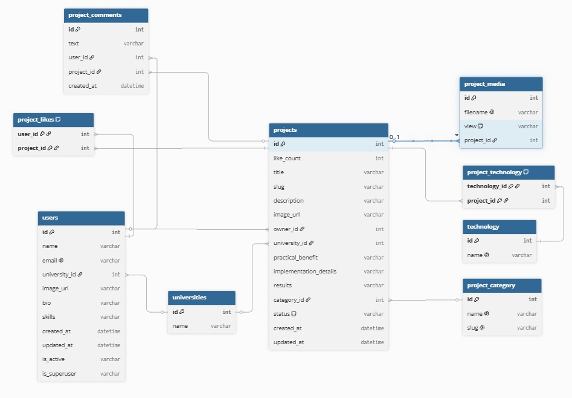

# Matryoshka — витрина студенческих проектов

Платформа для публикации и обмена студенческими проектами: пользователи создают карточки проектов с описанием, технологиями и медиа, оставляют комментарии и лайки. Есть привязка к университетам и категориям для удобной фильтрации.

# Стек технологий

- **Backend**: FastAPI, SQLAlchemy (async ORM), Alembic (миграции), Pydantic (валидация), fastapi-users (аутентификация)
- **База данных**: PostgreSQL
- **Frontend**: React, Vite
- **Инфраструктура**: Docker / docker-compose, Caddy (reverse proxy)
- **CI/CD**: GitHub Actions

# Установка и запуск
## 1. Клонировать проект
```bash
    git clone https://github.com/wesorat/matryoshka.git
    cd matryoshka
```
## 2. Создать .env файл на основе .env.example
## 3. Запустить через Docker Compose
```bash
    docker-compose up --build -d
```
## 4. Применить миграции
```bash
    docker exec -it matryoshka_backend alembic upgrade head
```
## 5. API будет доступен по адресам
- **Backend**: http://localhost:8000 (**OpenAPI-схема**: `backend/openapi.json`)
- **Frontend**: http://localhost:5173
# Для заполнения словарей и ручной demo-генерации

`seed_for_db.sql` содержит постоянные справочники: категории проектов и роли. Его нужно применить до запуска demo generator. Файл идемпотентен: категории обновляются по `project_category.slug`, роли обновляются по `roles.name`.

На сервере в native container mode:

```bash
ENV_FILE="$PWD/.env.native" ./scripts/container-native/status.sh
curl http://127.0.0.1:8000/api/health

ENV_FILE="$PWD/.env.native" ./scripts/container-native/apply-seed-dictionaries.sh

ALLOW_DEMO_SEED=1 \
ENV_FILE="$PWD/.env.native" \
DEMO_SEED_BASE_URL=http://127.0.0.1:8000 \
./scripts/container-native/seed-demo-data.sh

curl http://127.0.0.1:8000/projects/
curl 'http://127.0.0.1:8000/category/?has_projects=true'
```

Demo generator запускается только вручную и только с `ALLOW_DEMO_SEED=1`. По умолчанию он создает умеренный набор русских demo-данных: `DEMO_SEED_USERS=3`, `DEMO_SEED_PROJECTS_PER_USER=4`. При повторном запуске существующие demo-пользователи `demoN@example.com` переиспользуются, а создание проектов для пользователя пропускается, если у него уже есть проекты.

Для локального Docker-режима порядок такой же: сначала применить `seed_for_db.sql`, затем запускать `backend/generate_test_db.py` с `ALLOW_DEMO_SEED=1` и `DEMO_SEED_BASE_URL` на backend API.

# Production

Локальная проверка:

```bash
docker compose --env-file .env.prod -f docker-compose.prod.yml up --build -d
curl http://localhost:8080/
curl http://localhost:8080/api/health
docker compose --env-file .env.prod -f docker-compose.prod.yml down
```

`DB_PASSWORD` и `SECRET` обязательны.
PostgreSQL и backend наружу не публикуются.

# Для DevOps

В контейнерной среде HTTPS уже завершается внешним proxy. Внутренний native Caddy слушает только `:80`; сертификаты внутри контейнера не выпускаются.

Native deploy для контейнерной среды:

```bash
cp .env.native.example .env.native
# заполнить DB_PASSWORD и SECRET
./scripts/container-native/deploy.sh
```

Frontend для native container mode собирается с `VITE_API_URL=/api`, поэтому API идет через внутренний Caddy на `127.0.0.1:8000`.
PostgreSQL запускается на уровне пользователя через `pg_ctl`, который native scripts находят сами, включая `/usr/lib/postgresql/*/bin`.
PostgreSQL слушает `127.0.0.1:5432`, а локальный socket лежит в `$HOME/matryoshka-runtime/postgres-run`, не в `/var/run/postgresql`.
Runtime-файлы, PostgreSQL data, uploads, logs, pid-файлы и backend venv лежат в `$HOME/matryoshka-runtime`.

CI/CD через GitHub Actions настроен в `.github/workflows/ci-cd.yml`. Workflow запускается на push в `main` и `devops/container-native-deploy`, а также вручную через `workflow_dispatch`. CI проверяет backend compile, Alembic env syntax, frontend build, shell syntax и whitespace; `npm run lint` не запускается.

Для deploy нужно добавить GitHub Secrets:

```text
DEPLOY_HOST=194.190.136.78
DEPLOY_PORT=2206
DEPLOY_USER=team6
DEPLOY_SSH_KEY=<private ssh key>
DEPLOY_PATH=/home/team6/matryoshka
DEPLOY_BRANCH=devops/container-native-deploy
```

SSH private key хранится только в GitHub Secrets. Лучше использовать отдельный deploy key/user key с доступом только к серверу. `.env.native` создается вручную на сервере в `/home/team6/matryoshka/.env.native` и не хранится в GitHub.

Автоматический deploy после успешного CI подключается к серверу по SSH, выполняет fast-forward pull нужной ветки, готовит backend/frontend окружение, запускает PostgreSQL при необходимости, применяет миграции, перезапускает backend и Caddy, затем проверяет health checks.

Запустить release вручную на сервере:

```bash
ENV_FILE="$PWD/.env.native" DEPLOY_BRANCH=devops/container-native-deploy ./scripts/container-native/release.sh
```

Запустить процессы:

```bash
ENV_FILE="$PWD/.env.native" ./scripts/container-native/start-postgres.sh
ENV_FILE="$PWD/.env.native" ./scripts/container-native/migrate.sh
ENV_FILE="$PWD/.env.native" ./scripts/container-native/start-backend.sh
ENV_FILE="$PWD/.env.native" ./scripts/container-native/start-caddy.sh
```

Остановить процессы:

```bash
ENV_FILE="$PWD/.env.native" ./scripts/container-native/stop-caddy.sh
ENV_FILE="$PWD/.env.native" ./scripts/container-native/stop-backend.sh
ENV_FILE="$PWD/.env.native" ./scripts/container-native/stop-postgres.sh
```

Проверить внутри контейнера:

```bash
ENV_FILE="$PWD/.env.native" ./scripts/container-native/status.sh
curl http://127.0.0.1:8000/api/health
curl http://127.0.0.1/api/health
curl http://127.0.0.1/
curl http://127.0.0.1/_proxy_health
```

Проверить снаружи:

```bash
curl https://matryoshka.st.ifbest.org/api/health
```

Первичная подготовка VDS:

```bash
./scripts/server-bootstrap.sh
```

Запуск деплоя:

```bash
cd /opt/matryoshka
./scripts/deploy.sh
```

Проверить:

```bash
curl https://matryoshka.st.ifbest.org/api/health
```

# Архитектурная схема

<p align="center">
  
</p>

# Схема базы данных

<p align="center">
  
</p>